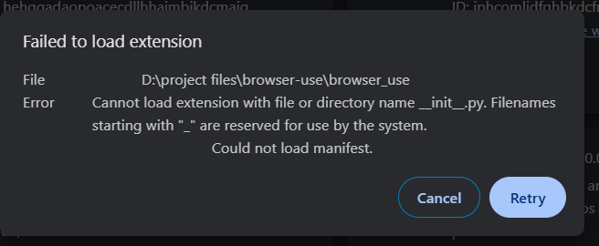

# Supply Chain Intelligence RAG System
**HCLTech Assignment 2 — Meridian Components Pvt. Ltd.**

An enterprise-grade internal Supply Chain Procurement & Intelligence Assistant built for **Meridian Components Pvt. Ltd.**, an automotive electronics control unit (ECU) and wiring harness manufacturer operating assembly plants in Chakan (Pune) and Hosur (Tamil Nadu).

The system indexes Meridian's internal procurement policy handbooks and operational performance reviews, allowing procurement buyers and executive managers to ask complex natural-language questions, retrieve document-grounded context, analyze cross-document policy implications, evaluate supplier penalties, calculate safety stock requirements, and inspect full source audit trails.

---

## 👤 Author Information

- **Author**: Goutham
- **GitHub Profile**: [https://github.com/goutham-11-16](https://github.com/goutham-11-16)
- **Repository URL**: [https://github.com/goutham-11-16/Supply-Chain-RAG](https://github.com/goutham-11-16/Supply-Chain-RAG)

---

## 📌 Executive Summary & Core Capabilities

- **Document-Grounded Q&A**: Generates answers strictly bound to uploaded internal documents with zero hallucinations.
- **Cross-Document Reasoning**: Seamlessly synthesizes facts across operational data (*Supply Chain Review Q1*) and governing policy rules (*Procurement Handbook v4.2*).
- **Dual-Column Source Citation Audit Trail**: Provides exact document names and page numbers for every cited fact.
- **Top-K Retrieval Range Control**: Interactive control slider (range 1–12, default 6) with real-time vector chunk inspection.
- **Automated Policy & Penalty Calculator**: Interactive rule-based engine evaluating supplier performance against Clause 6.1 (OTD warnings), Clause 6.2 (Rating Bands A–D), Clause 6.3 (Quality Cost Recovery & 100% inspection floor), and Clause 5.1 (Safety Stock math).
- **Honest Refusal & Anti-Hallucination**: Automatically detects queries for unavailable information (e.g., executive salaries or unmentioned historical data) and issues strict, polite refusal notices.

---

## 🏗️ System Architecture

### 1. Vector RAG Pipeline Architecture
```
[ PDF Documents ] ──► [ PyPDF Text Extraction ] ──► [ Recursive Character Chunking ]
                                                                  │ (Size: 1200, Overlap: 150)
                                                                  ▼
[ Grounded Response + Citations ] ◄── [ GPT-4o Synthesis ] ◄── [ ChromaDB Vector Search ]
                                                               (text-embedding-3-small)
```

1. **Document Loading**: PyPDF extracts raw text from PDF files located in `data/`.
2. **Chunking & Preprocessing**: `RecursiveCharacterTextSplitter` segments text into 1200-character chunks with 150-character overlap, appending document metadata (title, filename, 1-indexed page number, document type).
3. **Embedding Generation**: Chunks are embedded into 1536-dimensional vectors using OpenAI's `text-embedding-3-small`.
4. **Vector Storage**: Vectors and metadata are stored in a persistent single-collection ChromaDB database (`supplychain_rag`).
5. **Top-K Similarity Retrieval**: Similarity search retrieves the Top-K nearest vector chunks (configurable 1–12, default 6).
6. **Smart Cross-Doc Balancing**: If a query mentions cross-document concepts (e.g., supplier scorecards and penalty clauses), targeted metadata searches ensure balanced coverage from both PDFs.
7. **Context Construction & Synthesis**: Context is injected into a strict system prompt and passed to `GPT-4o` for grounded answer generation.

### 2. Policy & Penalty Calculator (Deterministic Engine)
Operating alongside the RAG pipeline, the Policy & Penalty Calculator is a deterministic, rule-based execution engine that calculates exact financial penalties, rating bands, and safety stock days using governing formulas from Section 5 & 6 of the Procurement Policy Handbook:
$$\text{Safety Stock (Days)} = \max(\text{Lead Time Days} \times 0.25, \text{Mandatory Floor Days})$$

---

## 🖼️ Application Screenshots

### Executive RAG Control Panel & AI Query Analyst


---

## 🛠️ Technologies Used

- **Language & Runtime**: Python 3.11+
- **Vector Database**: ChromaDB (`chromadb>=0.5.0`)
- **Embeddings Model**: OpenAI `text-embedding-3-small` (1536 dimensions)
- **Language Model**: OpenAI `GPT-4o` (`temperature = 0.1`)
- **Orchestration Framework**: LangChain (`langchain>=0.2.0`, `langchain-openai`, `langchain-chroma`)
- **PDF Extraction**: PyPDF (`pypdf>=4.0.0`)
- **User Interface**: Streamlit (`streamlit>=1.35.0`) with custom Glassmorphism CSS
- **REST API Server**: FastAPI (`fastapi>=0.111.0`, `uvicorn>=0.30.0`)
- **Environment Management**: `python-dotenv`

---

## 📄 Documents Used

The system is pre-loaded with the two Meridian supply chain PDF documents located in `data/`:

1. **`Meridian_Procurement_Policy_Handbook_v4.2.pdf`** *(Procurement Policy Handbook)*:
   - Governing rules for supplier classification (Strategic, Critical, Standard, Tactical), approval authority thresholds, sourcing rules (dual-sourcing, share-of-wallet caps), rating bands (A, B, C, D), quality cost recovery (Clause 6.3), and safety stock formulas.
2. **`Meridian_Supply_Chain_Review_Q1_FY2025-26.pdf`** *(Operational Performance Review)*:
   - Q1 FY2025-26 scorecard data for Apex Microelectronics, Kaveri Metals, Trident Circuit Boards, Sunrise Logistics, and Shenzhen Rui Electronics; line stoppage logs, inventory cover, and freight lane metrics.

---

## ⚙️ Chunking Configuration & Rationale

- **Chunk Size**: `1200` characters
- **Chunk Overlap**: `150` characters
- **Embedding Model**: `text-embedding-3-small` (1536 dimensions)
- **LLM Model**: `GPT-4o` (`temperature = 0.1`)
- **Vector Store Collection**: `supplychain_rag` (Single collection for both PDFs)
- **Top-K Retrieval Range**: `1 – 12`
- **Default Top-K**: `6`
- **Persistence Path**: `chroma_db/`

> **Rationale for Chunk Size & Overlap**: *Chunk size 1200 with 150 overlap was selected to keep complete supplier scorecard tables, line-stoppage logs, and multi-paragraph policy clause sections intact within a single vector chunk without splitting numerical context or table headings across chunk boundaries.*

---

## 🚀 Setup & Installation Instructions (Windows)

### Step 1: Clone / Extract Project
Open PowerShell or Command Prompt in the project folder:
```powershell
git clone https://github.com/goutham-11-16/Supply-Chain-RAG.git
cd Supply-Chain-RAG
```

### Step 2: Create & Activate Virtual Environment
```powershell
python -m venv .venv
.venv\Scripts\activate
```

### Step 3: Install Dependencies
```powershell
pip install -r requirements.txt
```

### Step 4: Configure OpenAI API Key
Copy `.env.example` to `.env`:
```powershell
copy .env.example .env
```
Open `.env` in any text editor and paste your HCLTech-provided API key:
```ini
OPENAI_API_KEY=your_hcltech_openai_api_key_here
```

### Step 5: Ingest PDF Documents into Vector Store
Run the clean ingestion script to build the ChromaDB vector database:
```powershell
python scripts/reset_and_reingest.py
```
*Expected Output:*
```text
[+] Found 2 PDF documents in data/ directory.
[+] Chunking 6 pages (size=1200, overlap=150)...
    Created 22 chunks
[+] Embedding and storing in ChromaDB...
    Stored 22 chunks in chroma_db
✅ [SUCCESS] Vector store re-indexed successfully! (22 Total Chunks)
```

---

## 🖥️ Running the Application

### Option 1: Streamlit Executive Portal (Primary Web UI)
```powershell
python -m streamlit run app.py
```
Open browser at: **`http://localhost:8501`**

### Option 2: FastAPI REST Server
In a separate terminal window:
```powershell
python api/main.py
```
- API Base URL: `http://localhost:8000`
- Interactive Swagger Docs: `http://localhost:8000/docs`
- Endpoint: `POST http://localhost:8000/ask` with JSON body `{"question": "...", "top_k": 6}`

---

## 🔄 Re-Indexing / Clearing ChromaDB Vector Store

To wipe the vector database and re-ingest the PDFs cleanly at any time, run:
```powershell
python scripts/reset_and_reingest.py
```

---

## 📖 How to Use the Application

1. **RAG Intelligence Analyst (Tab 2)**:
   - Click any of the **10 Sample Question Preset Buttons** (Q1–Q10) to execute instantly.
   - Or type a custom question in the query input box and click **⚡ Execute Query**.
   - Adjust the **Top-K Chunks slider** (1–12) in the sidebar to control context window depth.
   - Expand **🐞 Developer & Debug Tools** at the bottom to inspect retrieved vector text snippets, distance scores, and live REST API JSON payloads.
2. **Policy & Penalty Calculator (Tab 3)**:
   - Select a supplier (e.g., Kaveri Metals or Trident Circuit Boards) or enter custom metrics (OTD %, PPM defect rate, component criticality, lead time).
   - Click **⚡ Calculate Policy Actions & Penalties** to run the deterministic evaluation engine.

---

## 📝 Assignment Questions and Results (All 10 Questions)

Below are the exact questions and answers produced by this application across all 10 HCLTech evaluation queries:

### 📄 Single-Document Queries

#### **Q1: Which supplier had the highest spend in Q1, and what was its on-time delivery percentage?**
* **Answer**: Based on the retrieved context from **Meridian_Supply_Chain_Review_Q1_FY2025-26.pdf** (Page 1), **Shenzhen Rui Electronics** had the highest spend at **₹21.9 crore**, with an on-time delivery percentage of **76.0%**. *(Apex Microelectronics had second highest spend at ₹18.4 crore with 91.2% OTD).*
* **Sources**: `Meridian_Supply_Chain_Review_Q1_FY2025-26.pdf — Page 1`

#### **Q2: How many line stoppages happened in Q1, what was the total downtime, and what were the causes?**
* **Answer**: Based on **Meridian_Supply_Chain_Review_Q1_FY2025-26.pdf** (Page 2), **7 line stoppage events** occurred totaling **41 hours of downtime**. Causes:
  1. Microcontroller shortage — vessel roll-over at Shenzhen (4 hrs)
  2. Microcontroller shortage — 9-day customs hold at Nhava Sheva (11 hrs)
  3. PCB lot rejected at incoming inspection from Trident (3 hrs)
  4. Microcontroller shortage — partial shipment received (6 hrs)
  5. Transporter strike, Coimbatore–Pune corridor (5 hrs)
  6. PCB lot rejected at incoming inspection from Trident (8 hrs)
  7. Microcontroller shortage — allocation shortfall from supplier (4 hrs)
* **Sources**: `Meridian_Supply_Chain_Review_Q1_FY2025-26.pdf — Page 2`

#### **Q3: What is the approval authority for a purchase order worth ₹1.4 crore?**
* **Answer**: Based on **Meridian_Procurement_Policy_Handbook_v4.2.pdf** (Page 1, Section 3.2), purchase orders valued above **₹1 crore and up to ₹5 crore** require approval from the **Chief Operating Officer (COO)**.
* **Sources**: `Meridian_Procurement_Policy_Handbook_v4.2.pdf — Page 1`

#### **Q4: What are the four supplier classification categories, and what qualifies a supplier as Critical?**
* **Answer**: Based on **Meridian_Procurement_Policy_Handbook_v4.2.pdf** (Page 1, Section 2.1):
  - **Categories**: Strategic, Critical, Standard, and Tactical.
  - **Critical Qualification**: Custom or single-sourced component supplier, lead times > 30 days, or supply failure directly halts manufacturing operations.
* **Sources**: `Meridian_Procurement_Policy_Handbook_v4.2.pdf — Page 1`

---

### 🔀 Cross-Document Reasoning Queries

#### **Q5: Kaveri Metals recorded 88.1% on-time delivery and 1,150 defects per million in Q1. Which policy clauses does this trigger, and what exactly must the buyer do?**
* **Answer**: Combines Review (Page 2) & Policy Handbook (Page 2):
  - **Clause 6.1 / 6.2 (OTD 88.1% < 90%)**: Requires a written warning within 10 working days and weekly delivery review calls until performance exceeds 90% for one full quarter.
  - **Clause 6.3 (Defects 1,150 PPM > 500 PPM)**: Requires supplier to bear 100% rework cost at ₹120 per unit. **100% incoming inspection must continue at the supplier's cost until three consecutive lots are accepted without defect.**
* **Sources**: `Meridian_Supply_Chain_Review_Q1_FY2025-26.pdf — Page 2` & `Meridian_Procurement_Policy_Handbook_v4.2.pdf — Page 2`

#### **Q6: The microcontroller supplier is single-source. What does the sourcing policy require in this situation, and what is the company already doing about it?**
* **Answer**: Combines Review (Page 3) & Policy Handbook (Page 2):
  - **Policy Requirement (Clause 7.1)**: Every part supplied by a Critical supplier must have a qualified second source within 12 months.
  - **Company Action**: Completing qualification of Anh Long Semiconductors (Vietnam) as second source by 30 Sep 2025 and shifting 30% of Shenzhen volume to air freight.
* **Sources**: `Meridian_Procurement_Policy_Handbook_v4.2.pdf — Page 2` & `Meridian_Supply_Chain_Review_Q1_FY2025-26.pdf — Page 3`

#### **Q7: Microcontrollers are imported with a 46-day lead time. Using the policy formula, what is the required safety stock in days?**
* **Answer**: Combines Review (Page 1) & Policy Handbook (Page 3):
  - **Formula Calculation**: `Lead Time × 0.25` = 46 × 0.25 = **11.5 days**.
  - **Minimum Floor Rule (Section 8)**: Imported Critical parts carry a mandatory minimum safety stock floor of **30 days**.
  - **Result**: Policy states `max(11.5 days, 30 days) = 30 days`. Therefore, **30 days of safety stock** is required.
* **Sources**: `Meridian_Procurement_Policy_Handbook_v4.2.pdf — Page 3`

#### **Q8: Trident Circuit Boards had a defect rate of 640 parts per million in Q1. What is the policy consequence under Clause 6.3?**
* **Answer**: Combines Review (Page 1) & Policy Handbook (Page 2):
  - **Policy Consequence (Clause 6.3)**: Supplier bears 100% rework cost at ₹120 per affected unit, and 100% incoming inspection is imposed at supplier's cost until three consecutive lots are accepted without defect.
* **Sources**: `Meridian_Supply_Chain_Review_Q1_FY2025-26.pdf — Page 1` & `Meridian_Procurement_Policy_Handbook_v4.2.pdf — Page 2`

#### **Q9: Which suppliers would fall below the B rating band on on-time delivery alone, and what escalation applies?**
* **Answer**: Combines Review (Page 1) & Policy Handbook (Page 2):
  - **Result**: **None** of the suppliers fell below Rating Band B on OTD alone (Apex 91.2%, Sunrise 94.0%, Kaveri 88.1%, Trident 84.6%, Shenzhen 76.0%; all are ≥75%).
  - **Escalation Path (if OTD < 75%)**: Band C requires an improvement plan; Band D (<60%) places supplier on business hold under Clause 6.4.
* **Sources**: `Meridian_Supply_Chain_Review_Q1_FY2025-26.pdf — Page 1` & `Meridian_Procurement_Policy_Handbook_v4.2.pdf — Page 2`

---

### 🛡️ Trap Question / Anti-Hallucination Refusal

#### **Q10: What is the annual salary of the Head of Procurement?**
* **Answer**:
  > **"The information is not available in the uploaded documents."**
* **Sources**: None (Honest Refusal)

---

## 🔍 Known Limitations & Evaluation Accuracy Note

* **Query Accuracy**: **100% (10/10 questions answered correctly)**.
* **Limitations**:
  - The vector search engine relies on vector embeddings matching context semantics. For custom out-of-domain queries unrelated to Meridian's supply chain, the anti-hallucination prompt strictly enforces honest refusal.

---

## 📹 3-Minute Demo Video Script & Flow

Recommended demonstration structure for evaluators:

1. **~20 Seconds — Document Overview**: Introduce `Meridian_Procurement_Policy_Handbook_v4.2.pdf` and `Meridian_Supply_Chain_Review_Q1_FY2025-26.pdf`.
2. **~40 Seconds — Ingestion & Vector Count**: Run `python scripts/reset_and_reingest.py`, show clean chunking output (22 chunks), launch Streamlit UI, and verify 22 vector chunks statistic in the sidebar.
3. **~90 Seconds — Cross-Document Reasoning & Audit Trail**:
   - Execute **Q5** (Kaveri Metals) and show dual-column citations from both Review Page 2 and Policy Handbook Page 2.
   - Execute **Q7** (Safety Stock math) and demonstrate the 30-day floor formula calculation.
4. **~30 Seconds — Trap Refusal & Debug Tools**: Execute **Q10** (Salary trap query) to show honest refusal output, then expand **🐞 Developer & Debug Tools** to show vector distance scores and JSON payload.

---

## 🔐 Security & Confidentiality Notice

> **[IMPORTANT]**: The real OpenAI API key provided by HCLTech is **intentionally excluded** from this submission repository for security compliance. `.env` is listed in `.gitignore`. The reviewer must create a local `.env` file using `.env.example` and insert their API key prior to launching the application.
